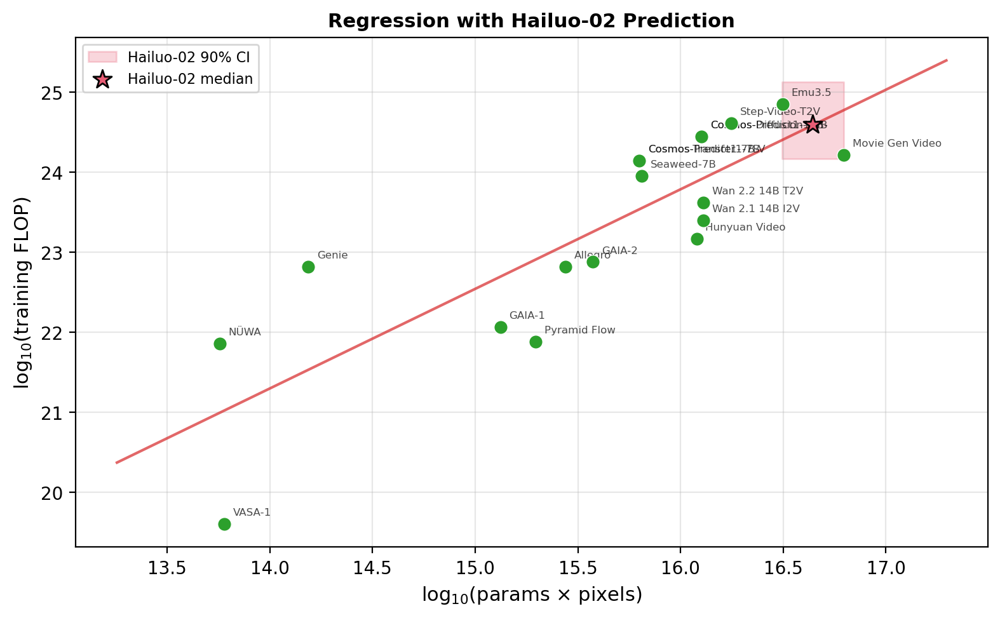
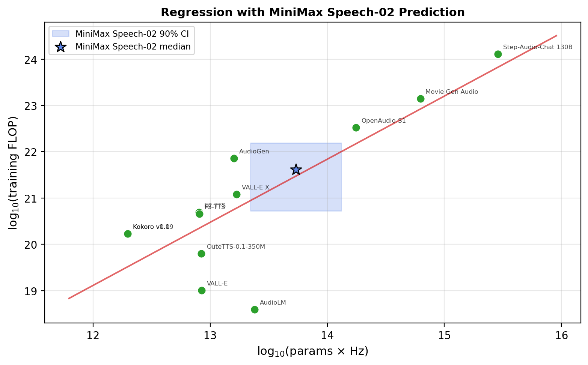
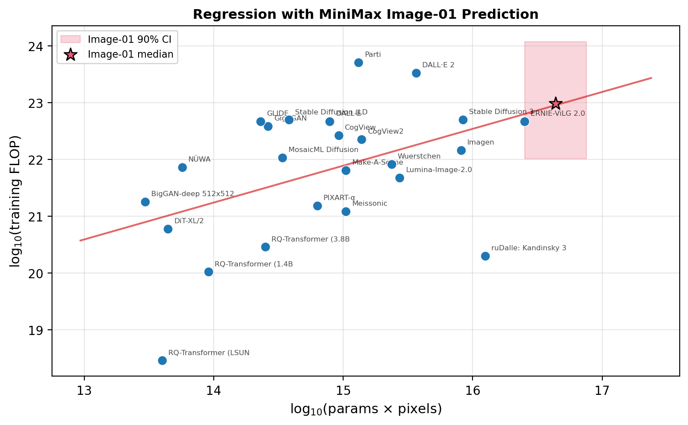

## Rule 1: Direct summation for base models with inclusive compute reporting

First, for models where Epoch AI reports the total training compute inclusive of post-training (e.g., Minimax M1), we use that estimate directly with no Monte Carlo on the FLOP count.

## Rule 2: Post-training overhead for pre-training-only estimates

Second, for post-trained models where Epoch only reports pre-training via 6ND (e.g., GLM-4.5), we add a post-training overhead. It is log-normally distributed, with the 10th and 90th percentiles anchored at 1% to 10% of the pre-training compute.

## Rule 3: Marginal FLOP for finetuned models

Third, for models that were finetuned on a base model, we use only the marginal FLOP, or the finetune cost itself, not the total that includes base pre-training. The base model's pre-training is already counted as its own separate entry. If our database of AI models contains a model's finetune compute (e.g., GLM-4.5V), we directly use that. For RL finetunes (e.g., GLM-Z1-Rumination), we assume a log-normal distribution with the 10th and 90th percentiles set at 1% and 10% of the base model's median training cost. We also apply a low MFU assumption of 0.01–0.10 for RL, as mentioned before.

## Rule 4: Estimating compute for closed-source models via regression

Fourth, there are closed-sourced models without information on their training compute: Hailuo 02, Hailuo I2V-01-Director (base model is Hailuo-01), Hailuo T2V-01-Director (base model is Hailuo-01), CogVideoX, Speech-01-turbo, Speech-02-turbo, Speech-01-HD, Speech-02-HD, and Image-01. We estimate the pre-training and post-training compute for these models. Note, though Hailuo-01 is outside of our model release time window, we still have to estimate its pre-training compute to get to the finetune estimation of Hailuo I2V-01-Director and Hailuo T2V-01-Director. For Hailuo-01 and Hailuo-02, we used the following procedure to estimate their pre-training compute:

Step 1: Gather data on other video generation models.
I use video models from Epoch's AI models dataset. We also gather the resolution of those models. Then, we keep only those with pre-training FLOP, parameter count, and resolution. We have 18 models at the end.

Step 2: Regress with Bootstrap
Next, we run a log-log OLS (Ordinary Least Squares) regression of log(training FLOP) on log(params × pixels). We get the slope and intercept.

Step 3: Perform a Monte Carlo on Hailuo's parameter number.
The number of parameters of Hailuo 02 is unknown. We hypothesize a distribution of Uniform(15 bn, 30 bn). With each regression, we draw a single random sample of Hailuo 02's parameters. Then, we compute log(sampled parameters × 1080p_pixels) as the independent variable. Next, we predict log(training FLOP) from the regression line.

Step 4: Bootstrap by repeating Steps 2 and 3.
I repeat steps 2 and 3 by bootstrapping. We bootstrap the regression (20k iterations) by resampling the data points with replacement.

Result: A 90% confidence interval of [1.22e24, 1.76e25] and a median of 3.98e24. R2 = 0.688.

I repeat this procedure for the speech models and image models. For speech models, we use the slope of the regression of log(training FLOP) on log(params × sample rate of the output audio) to estimate the pre-training compute. For image models, we use the slope of the regression of log(training FLOP) on log(params × resolution of the output image) to estimate the pre-training compute. The results are shown below.

We then draw from uniform distribution whose support spans the 90% confidence interval estimated from these procedures in our Monte Carlo process to estimate the final training compute spent on those models. For the models listed above, we also add an overhead post-training compute, drawn from a log-normal distribution with the 10th and 90th percentiles set at 0.1% and 5% of the pre-training compute. Note the smaller variance and computational overhead typical of supervised finetuning of video, speech, and image models. We also use the global MFU (log-normal with the 10th and 90th percentiles anchored at 0.15 and 0.35) for supervised finetuning.

## Rule 5: Estimating compute for other closed-source models

Three models remain with unknown training compute: GLM-4-Voice, GLM-Realtime, and MiniMax-M2.

For the GLM-4-Voice and GLM-Realtime, I did not use the same method of estimation as for some video models, because there are relatively few public benchmarks and disclosures for real-time speech-to-speech models.

For GLM-4-Voice, I estimate the final training run at 5.4e22 FLOP at the median, with a uniform distribution of 4e22 FLOP to 8e22 FLOP. This estimate is based on the paper's statement that GLM-4-Voice continues pretraining from GLM-4-9B and scales that stage to approximately 1 trillion tokens. Using the standard dense-transformer rule of thumb, Training FLOP≈6ND.

For GLM-Realtime, I estimate the final training run at 2e23 FLOP at the median, with a uniform distribution of 1.3e23 FLOP to 3.2e23 FLOP. The estimate is based on Zhipu listing the model as a 32B real-time model, while not publicly disclosing an exact training-token count. I therefore anchor the estimate to nearby GLM voice/realtime models and assume a training budget of around 1 trillion tokens. Using the usual dense-transformer rule of thumb for training compute, this gives a midpoint estimate of ~2e23 FLOP.

We then add an overhead post-training compute for supervised finetuning, drawn from a log-normal distribution with the 10th and 90th percentiles set at 0.1% and 5% of the pretraining compute.

For MiniMax-M2, I estimate the pretraining at 1.05e24 FLOP at the median, with a uniform distribution on [6e23 FLOP, 1.5e24 FLOP]. According to HuggingFace, MiniMax-M2 is a 229B-parameter MoE with approximately 10B active parameters per token. The main uncertainty is the number of pretraining tokens.

Using the standard MoE approximation, training FLOP ≈ 6ND, where N = active parameters and D = tokens. I bound the token count at 10T–25T. The lower bound of 10T tokens is roughly comparable to MiniMax-Text-01's ~11T-token training set. The upper bound of 25T tokens corresponds to ~2,500 tokens per active parameter, consistent with heavily overtrained inference-efficient models.

We then add an overhead post-training (RL) compute, drawn from a log-normal distribution with the 10th and 90th percentiles set at 1% and 10% of the pre-training compute.
